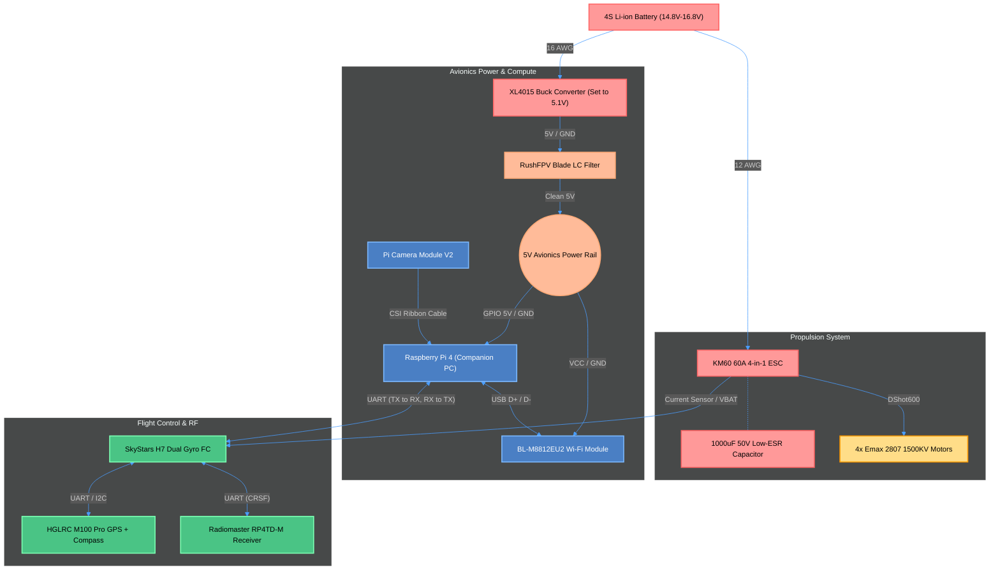

```mermaid
%%{init: {'theme': 'dark', 'themeVariables': {'fontSize': '14px', 'primaryColor': '#1e1e1e', 'primaryTextColor': '#ffffff', 'primaryBorderColor': '#4a9eff', 'lineColor': '#4a9eff'}, 'flowchart': {'useMaxWidth': true}}}%%
flowchart TD
    %% Define Styles
    classDef power_high fill:#ff9999,stroke:#ff6666,stroke-width:2px,color:#000000
    classDef power_low fill:#ffbb99,stroke:#ffaa77,stroke-width:2px,color:#000000
    classDef avionics fill:#4a7fc4,stroke:#7cb9ff,stroke-width:2px,color:#ffffff
    classDef flight fill:#4ac485,stroke:#7cffb3,stroke-width:2px,color:#000000
    classDef actuator fill:#ffdd88,stroke:#ff9900,stroke-width:2px,color:#000000

    %% Main Power Source
    BAT["4S Li-ion Battery (14.8V-16.8V)"]:::power_high

    %% Splitting the Main Power
    BAT -->|12 AWG| ESC_P["KM60 60A 4-in-1 ESC"]:::power_high
    BAT -->|16 AWG| BUCK["XL4015 Buck Converter (Set to 5.1V)"]:::power_high
    
    %% ESC Decoupling
    CAP["1000uF 50V Low-ESR Capacitor"]:::power_high
    ESC_P -.- CAP

    %% Avionics Power Regulation (5V Rail)
    BUCK -->|5V / GND| FILTER["RushFPV Blade LC Filter"]:::power_low
    FILTER -->|Clean 5V| PI_RAIL(("5V Avionics Power Rail")):::power_low

    %% Avionics Power Distribution
    PI_RAIL -->|GPIO 5V / GND| PI["Raspberry Pi 4 (Companion PC)"]:::avionics
    PI_RAIL -->|VCC / GND| WIFI["BL-M8812EU2 Wi-Fi Module"]:::avionics

    %% Flight Controller Power & DShot
    ESC_P -->|Current Sensor / VBAT| FC["SkyStars H7 Dual Gyro FC"]:::flight
    ESC_P -->|DShot600| MOTORS["4x Emax 2807 1500KV Motors"]:::actuator

    %% Peripheral Data Routing
    FC <-->|UART / I2C| GPS["HGLRC M100 Pro GPS + Compass"]:::flight
    FC <-->|UART #40;CRSF#41;| ELRS["Radiomaster RP4TD-M Receiver"]:::flight
    PI <-->|UART #40;TX to RX, RX to TX#41;| FC
    
    %% Camera & Wi-Fi Data
    CAM["Pi Camera Module V2"]:::avionics -->|CSI Ribbon Cable| PI
    PI <-->|USB D+ / D-| WIFI

    %% Subgraphs for visual grouping
    subgraph Propulsion System
        ESC_P
        CAP
        MOTORS
    end

    subgraph Avionics Power & Compute
        BUCK
        FILTER
        PI_RAIL
        PI
        WIFI
        CAM
    end

    subgraph Flight Control & RF
        FC
        GPS
        ELRS
    end
```