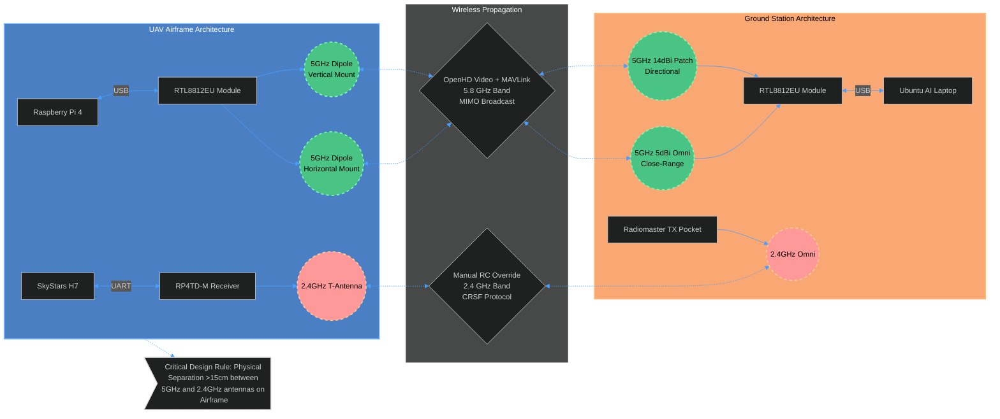

```mermaid
%%{init: {'theme': 'dark', 'themeVariables': {'fontSize': '14px', 'primaryColor': '#1e1e1e', 'primaryTextColor': '#ffffff', 'primaryBorderColor': '#4a9eff', 'lineColor': '#4a9eff'}, 'flowchart': {'useMaxWidth': true}}}%%
flowchart LR
    %% Styles
    classDef drone fill:#4a7fc4,stroke:#7cb9ff,stroke-width:2px,color:#ffffff
    classDef ground fill:#f9a873,stroke:#ffbc7a,stroke-width:2px,color:#000000
    classDef antenna_5g fill:#4ac485,stroke:#7cffb3,stroke-width:2px,stroke-dasharray: 5 5,color:#000000
    classDef antenna_2g fill:#ff9999,stroke:#ffcc99,stroke-width:2px,stroke-dasharray: 5 5,color:#000000

    subgraph Drone [UAV Airframe Architecture]
        direction TB
        PI[Raspberry Pi 4] <-->|USB| WIFI_AIR[RTL8812EU Module]
        FC[SkyStars H7] <-->|UART| ELRS_RX[RP4TD-M Receiver]
        
        WIFI_AIR --> ANT_A1((5GHz Dipole<br>Vertical Mount)):::antenna_5g
        WIFI_AIR --> ANT_A2((5GHz Dipole<br>Horizontal Mount)):::antenna_5g
        
        ELRS_RX --> ANT_E1((2.4GHz T-Antenna)):::antenna_2g
    end

    subgraph RF Link [Wireless Propagation]
        direction TB
        L1{OpenHD Video + MAVLink<br>5.8 GHz Band<br>MIMO Broadcast}
        L2{Manual RC Override<br>2.4 GHz Band<br>CRSF Protocol}
    end

    subgraph GroundStation [Ground Station Architecture]
        direction TB
        WIFI_GND[RTL8812EU Module] <-->|USB| PC[Ubuntu AI Laptop]
        TX[Radiomaster TX Pocket]
        
        ANT_G1((5GHz 14dBi Patch<br>Directional)):::antenna_5g --> WIFI_GND
        ANT_G2((5GHz 5dBi Omni<br>Close-Range)):::antenna_5g --> WIFI_GND
        
        TX --> ANT_E2((2.4GHz Omni)):::antenna_2g
    end

    %% Connections
    ANT_A1 <-.-> L1
    ANT_A2 <-.-> L1
    L1 <-.-> ANT_G1
    L1 <-.-> ANT_G2

    ANT_E1 <-.-> L2
    L2 <-.-> ANT_E2

    %% Separation Note
    note1>Critical Design Rule: Physical Separation >15cm between 5GHz and 2.4GHz antennas on Airframe]
    Drone -.-> note1

    class Drone drone
    class GroundStation ground
```