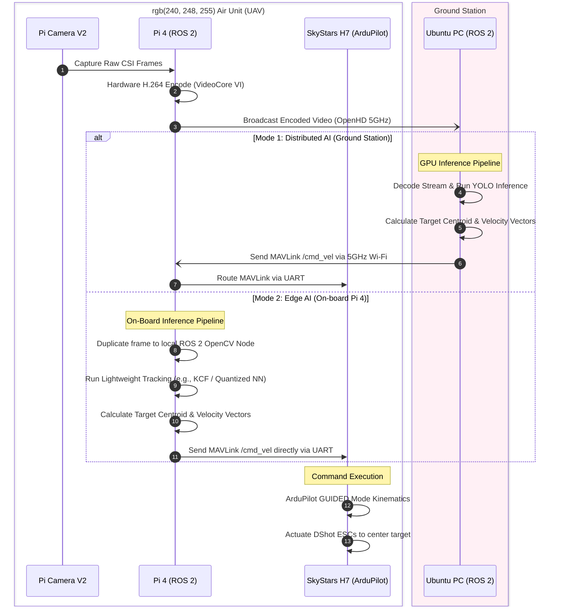

```mermaid
sequenceDiagram
    autonumber
    
    box rgb(240, 248, 255) Air Unit (UAV)
        participant CAM as Pi Camera V2
        participant PI as Pi 4 (ROS 2)
        participant FC as SkyStars H7 (ArduPilot)
    end
    
    box rgb(255, 240, 245) Ground Station
        participant GS as Ubuntu PC (ROS 2)
    end

    %% Base Video Pipeline
    CAM ->> PI: Capture Raw CSI Frames
    PI ->> PI: Hardware H.264 Encode (VideoCore VI)
    PI -) GS: Broadcast Encoded Video (OpenHD 5GHz)
    
    %% Dual-Mode Logic
    alt Mode 1: Distributed AI (Ground Station)
        Note over GS: GPU Inference Pipeline
        GS ->> GS: Decode Stream & Run YOLO Inference
        GS ->> GS: Calculate Target Centroid & Velocity Vectors
        GS -) PI: Send MAVLink /cmd_vel via 5GHz Wi-Fi
        PI ->> FC: Route MAVLink via UART
        
    else Mode 2: Edge AI (On-board Pi 4)
        Note over PI: On-Board Inference Pipeline
        PI ->> PI: Duplicate frame to local ROS 2 OpenCV Node
        PI ->> PI: Run Lightweight Tracking (e.g., KCF / Quantized NN)
        PI ->> PI: Calculate Target Centroid & Velocity Vectors
        PI ->> FC: Send MAVLink /cmd_vel directly via UART
    end

    %% Actuation (Same for both modes)
    Note over FC: Command Execution
    FC ->> FC: ArduPilot GUIDED Mode Kinematics
    FC ->> FC: Actuate DShot ESCs to center target
```