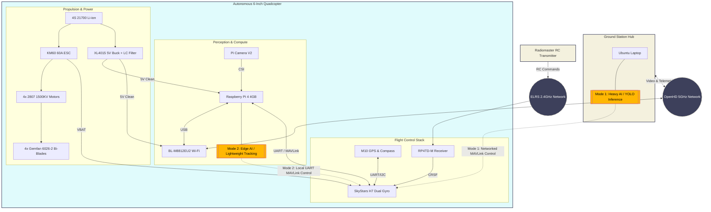

```mermaid
flowchart TD
    %% Node definitions
    subgraph Ground [Ground Station Hub]
        SYS_GS[Ubuntu Laptop]
        AI_GS[[Mode 1: Heavy AI / YOLO Inference]]
        SYS_GS --- AI_GS
    end
    SYS_RC[Radiomaster RC Transmitter]
    
    NET_OHD((OpenHD 5GHz Network))
    NET_ELRS((ELRS 2.4GHz Network))

    subgraph UAV [Autonomous 6-Inch Quadcopter]
        direction TB
        
        subgraph Payload [Perception & Compute]
            CAM[Pi Camera V2] -->|CSI| RPI[Raspberry Pi 4 4GB]
            RPI <-->|USB| WIFI_MOD[BL-M8812EU2 Wi-Fi]
            AI_PI[[Mode 2: Edge AI / Lightweight Tracking]]
            RPI --- AI_PI
        end
        
        subgraph Autopilot [Flight Control Stack]
            FC[SkyStars H7 Dual Gyro]
            GPS[M10 GPS & Compass]
            RX[RP4TD-M Receiver]
            
            GPS <-->|UART/I2C| FC
            RX -->|CRSF| FC
        end
        
        subgraph Powertrain [Propulsion & Power]
            BAT[4S 21700 Li-ion]
            PDB[XL4015 5V Buck + LC Filter]
            ESC[KM60 60A ESC]
            MOTORS[4x 2807 1500KV Motors]
            PROPS[4x Gemfan 6026-2 Bi-Blades]
            
            BAT --> ESC
            BAT --> PDB
            ESC --> MOTORS --> PROPS
        end
        
        %% Internal UAV Connections
        RPI <-->|UART / MAVLink| FC
        PDB -->|5V Clean| RPI
        PDB -->|5V Clean| WIFI_MOD
        ESC -->|VBAT| FC
    end

    %% External Network Connections
    Ground <-->|Video & Telemetry| NET_OHD
    NET_OHD <--> WIFI_MOD

    SYS_RC -->|RC Commands| NET_ELRS
    NET_ELRS --> RX
    
    %% Dual-Mode Relationship
    AI_GS -.->|Mode 1: Networked MAVLink Control| FC
    AI_PI -.->|Mode 2: Local UART MAVLink Control| FC
    
    %% Styling
    classDef ext fill:#f4f1de,stroke:#3d405b,stroke-width:2px
    classDef uav fill:#e0fbfc,stroke:#3d405b,stroke-width:2px
    classDef net fill:#3d405b,stroke:#f4f1de,stroke-width:2px,color:#fff
    classDef mode fill:#ffb703,stroke:#e07a5f,stroke-width:2px,color:#000
    
    class Ground,SYS_RC ext
    class UAV uav
    class NET_OHD,NET_ELRS net
    class AI_GS,AI_PI mode
```
