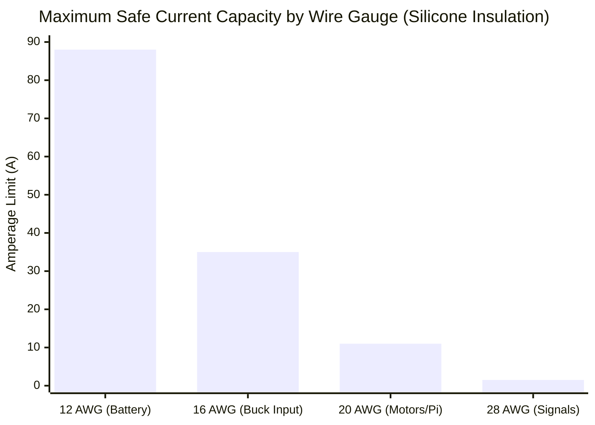
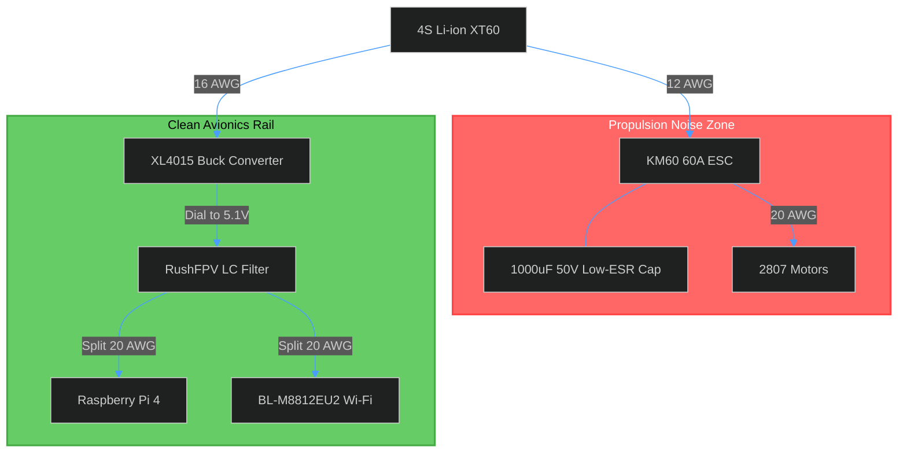
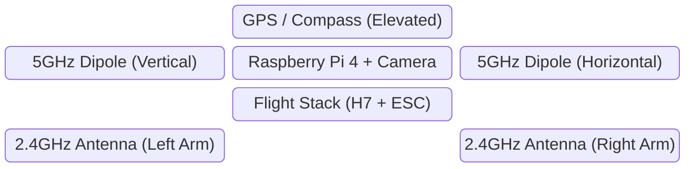

# Integration and Assembly Guide: 6-Inch Autonomous UAV

**Status:** Physical Airframe 80% Assembled | Electrical Integration Pending  
**Author:** Sarthak Rathi  
**Methodology:** Hardware packaging, electrical harness layout, RF isolation, and pre-flight validation protocols.

---

## 1. Introduction & Integration Philosophy

This document outlines the standard operating procedures for the physical assembly and electrical wiring of the autonomous drone platform. Because the platform combines high-current propulsion (up to 60A peak) with sensitive digital avionics (Raspberry Pi 4, OpenHD Wi-Fi), improper wiring will result in ground loops, brown-outs, and catastrophic system failures in flight.

The integration architecture follows three primary engineering directives:
1. **Power Isolation:** Complete decoupling of the 5V avionics rail from the flight controller’s internal BEC.
2. **RF Separation:** Spatial maximization between the 5GHz digital video transmission and 2.4GHz control links.
3. **Vibration Mitigation:** Mechanical isolation to prevent rigid-frame resonance from degrading the Flight Controller's IMU and the Pi Camera's optical stability.

---

## 2. Wire Gauge Standards and Routing

Using incorrect wire gauges introduces electrical resistance, causing voltage drops under load. The following standards have been established for the wiring harness based on peak continuous current draws.

| Subsystem Connection | Target Gauge (AWG) | Max Current Capacity | Insulation Type |
| :--- | :--- | :--- | :--- |
| **Battery → Main ESC Pads** | 12 AWG | ~60A+ | High-Flex Silicone |
| **ESC → Motors** | 20 AWG | ~15A | High-Flex Silicone |
| **Battery → XL4015 Buck Converter**| 16 - 18 AWG | ~10A | Silicone |
| **Buck 5V Output → Pi 4 & Wi-Fi** | 20 AWG | ~5A | Silicone |
| **Signal Wires (UART, GPS, ELRS)**| 26 - 30 AWG | < 1A | PTFE or Silicone |

---

## 3. Power Distribution and Filtering (The 5V Rail)

The most critical step in the assembly is the 5V avionics rail. The Raspberry Pi 4 and the RTL8812EU Wi-Fi module will draw transient spikes up to 3.5A total. **Do not power these from the SkyStars H7 FC.**

### 3.1 Step-by-Step Power Wiring
1. **Main Pads:** Solder the 12 AWG XT60 pigtail to the KM60 ESC main pads. 
2. **ESC Capacitor:** Directly solder the `1000uF 50V Low-ESR Capacitor` across the ESC battery pads. *Reason: Absorbs high-frequency regenerative braking voltage spikes from the ESC MOSFETs that could otherwise fry the step-down converter.*
3. **Buck Converter Branch:** Solder a 16 AWG wire branch from the ESC battery pads to the `XL4015 Buck Converter` input.
4. **Voltage Calibration (CRITICAL):** Before connecting the Pi 4, power the system with a battery and use a multimeter to dial the XL4015 potentiometer until the output reads **exactly 5.1V**.
5. **LC Filtering:** Route the 5.1V output through the `RushFPV Blade Power Filter Board`. This removes low-frequency ripple generated by the motors.
6. **Final Split:** From the filter board's output, run 20 AWG wires to the Raspberry Pi 4 (via 5V/GND GPIO pins) and the RTL8812EU Wi-Fi module.

---

## 4. Signal and Data Wiring

With power established, the data connections must be routed between the avionics and the flight stack.

### 4.1 Wi-Fi Module (BL-M8812EU2) USB Integration
Because the Wi-Fi module is a bare development board, it does not have a standard USB-A connector. The FPC (J3) connector is fragile and unnecessary.
*   **Action:** Direct solder to the USB interface pads.
*   **Wiring:** Solder the `D+` and `D-` pads on the Wi-Fi module directly to a stripped USB cable, and plug the USB-A end into the Raspberry Pi 4's **USB 2.0 port** (or solder directly to the Pi's underside USB test pads to save weight and space).

### 4.2 Flight Controller UART Mapping
The SkyStars H7 requires specific UART mapping for serial communications. Wires should be loosely braided to reduce electromagnetic interference (EMI).

| Peripheral | FC Connection | Protocol / Notes |
| :--- | :--- | :--- |
| **RP4TD-M (ELRS)** | UART 1 | `TX -> RX1`, `RX -> TX1`, 5V, GND. (CRSF Protocol) |
| **M100 Pro GPS** | UART 2 + I2C | `TX -> RX2`, `RX -> TX2`, SCL, SDA, 5V, GND. |
| **Raspberry Pi 4** | UART 3 | `TX -> RX3`, `RX -> TX3`, GND. (MAVLink telemetry routing). |

*Note on Grounding: The Pi 4 and the Flight Controller must share a common ground reference. Ensure the ground pin on the UART connection is securely soldered.*

---

## 5. RF Architecture and Antenna Placement

Antenna placement on a 6-inch quadcopter is severely constrained. Because the drone broadcasts 5GHz video (OpenHD) and receives 2.4GHz control (ELRS), poor placement will lead to RF desensitization (the "shouting next to a whisper" effect).

### 5.1 Rules for Placement
1. **ELRS Antennas (2.4GHz):** Mounted on the rear arms in a V-shape or T-shape using TPU mounts. Keep the active elements away from the carbon/nylon frame to avoid detuning.
2. **OpenHD Antennas (5GHz):** Mounted vertically on the top plate, spaced at least 90-degrees apart to leverage 2x2 MIMO polarization diversity.
3. **GPS Module:** Mounted on a 10cm–15cm TPU mast. The GPS ceramic antenna is highly sensitive to the broadband RF noise generated by the RunCam/Pi Camera ribbon cable and the Raspberry Pi's CPU.

*Spatial distribution map: Ensuring maximum physical separation between the 5GHz MIMO transmitting elements and the 2.4GHz receiver.*

---

## 6. Mechanical Assembly and Mounting

*   **Frame Material:** The airframe is 3D printed. While ASA or PA6-CF is recommended for rigidity, all structural screws must be secured using **medium-strength threadlocker (Loctite Blue 242)**. *Never use threadlocker on polycarbonate or directly touching ABS/ASA parts, as it degrades the plastic.*
*   **Vibration Damping:** The SkyStars H7 FC and the Raspberry Pi 4 must be mounted using silicone vibration gummies. This prevents high-frequency motor noise from aliasing into the gyro readings and corrupting the ArduPilot EKF estimation.
*   **Camera Mounting:** The Pi Camera V2 must be hard-mounted to the frame using a rigid TPU/PETG bracket. If the camera vibrates independently of the flight controller, the Computer Vision bounding-box calculations will conflict with the drone's IMU data, causing the autonomous tracking to oscillate.

---

## 7. Pre-Flight Validation Checklist

Before applying battery power to the fully integrated system, the following hardware checks must be executed:

- [ ] **Continuity Check (Main Power):** Use a multimeter in continuity mode across the main XT60 connector. It should read open-circuit (O.L). A beep indicates a fatal short.
- [ ] **Continuity Check (5V Rail):** Test continuity across the 5V and GND pins on the Raspberry Pi GPIO.
- [ ] **Voltage Verification:** Unplug the Pi 4 and Wi-Fi module. Plug in a battery. Measure the XL4015 output to guarantee it sits at exactly 5.0V - 5.1V.
- [ ] **Smoke Stopper:** For the first power-up with all components attached, utilize an inline Smoke Stopper (current-limiting PTC fuse) between the battery and the drone. If there is a hidden short, the fuse will trip before silicon is destroyed.
- [ ] **Conformal Coating:** Once testing is successful, coat the FC, ESC, Pi 4, and Wi-Fi module with a silicone conformal coating (e.g., MG Chemicals 422B) to protect against moisture and conductive debris. *Note: Mask off the barometer hole on the FC, USB ports, and the camera lens before coating.*