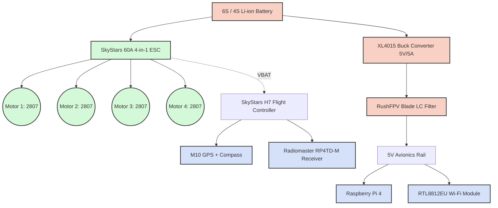
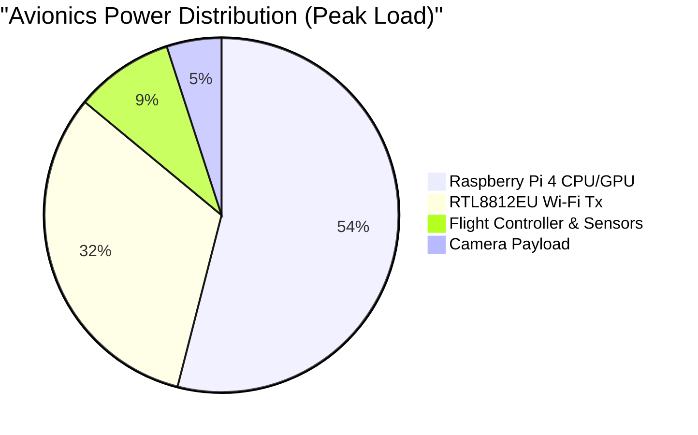
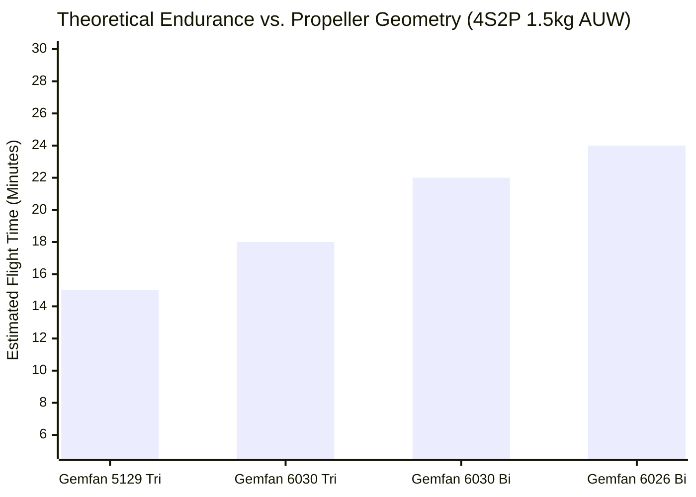

# Electrical Power Consumption and Endurance Modeling

**Status:** Theoretical Analysis & Component Validation  
**Methodology:** Thrust-stand datasheet extrapolation, component TDP (Thermal Design Power) analysis, and C-rating feasibility modeling.

## 1. Introduction
Endurance in a multirotor system is fundamentally an optimization of the $Energy / Power$ ratio. Unlike freestyle FPV drones, which prioritize peak burst current for acrobatic maneuvers, an autonomous research drone must minimize continuous hover current to maximize flight time. 

Because physical hover testing has not yet been conducted, this document presents the rigorous theoretical models used to design the drone's power distribution network, size the voltage regulators, and select the optimal Li-ion battery chemistry.

---

## 2. Power Distribution Architecture
A critical design requirement was safely powering a Raspberry Pi 4 and dual high-power Wi-Fi adapters without browning out the Flight Controller. Relying on the Flight Controller's onboard 5V BEC (typically rated for 2A–3A) to power a Raspberry Pi is a primary cause of in-flight failure in DIY autonomous drones.

To prevent this, the power architecture physically decouples the avionics load from the flight control load via a dedicated step-down (buck) converter.

---

## 3. Avionics Power Budget
The continuous electrical load of the onboard compute and communications hardware acts as a parasitic drain on the battery, effectively reducing available flight time.

### Estimated Current Draw (at 5V)
| Component | Nominal Draw (A) | Peak Draw (A) | Max Power (W) |
| :--- | :--- | :--- | :--- |
| **Raspberry Pi 4 (4GB)** | 1.2 A | 3.0 A | 15.0 W |
| **RTL8812EU Wi-Fi (Tx Mode)** | 0.8 A | 1.8 A | 9.0 W |
| **Pi Camera V2** | 0.2 A | 0.25 A | 1.25 W |
| **Flight Controller + GPS + ELRS** | 0.3 A | 0.5 A | 2.5 W |
| **Total Avionics Load @ 5V** | **~2.5 A** | **~5.55 A**| **~27.75 W** |

*Analysis:* The XL4015 Buck Converter is rated for **5A continuous (75W)**. During normal operation (OpenHD encoding + tracking), the system will draw ~2.5A to 3.0A, remaining safely within the regulator's thermal and electrical limits. 

---

## 4. Propulsion Power and Flight Time Modeling

The drone's All-Up Weight (AUW) dictates the required thrust per motor to maintain a hover. The relationship between thrust and power is non-linear; as disk loading increases, aerodynamic efficiency decreases. 

### Hover Thrust Assumptions
*   **Target Hover Thrust:** Drone AUW
*   **Thrust per Motor:** $AUW / 4$
*   **Motors:** Emax ECO II 2807 1500KV
*   **Propellers:** Gemfan LR 6026-2 (Bi-blade, highly efficient for low RPM).

### Battery Options Evaluated
The physical airframe bay and center-of-gravity (CG) was constrained to fit a **4S1P** pack. However, a **4S2P** pack was modeled mathematically to represent the platform's theoretical maximum endurance.

1.  **4S1P Li-ion (Molicel P45B):** 4500mAh | 300g | 45A Discharge | AUW: ~1.2 kg
2.  **4S2P Li-ion (Samsung 50S):** 10000mAh | 600g | 70A Discharge | AUW: ~1.5 kg

### Current Draw & Endurance Math
$Hover\_Time = \left( \frac{Battery\_Capacity\_Ah \times Usable\_Capacity\_Factor}{Total\_Hover\_Current\_A} \right) \times 60$
*(Assuming a safe 80% discharge rule for Li-ion cells to prevent voltage sag).*

| Metric | 4S1P Configuration (Built) | 4S2P Configuration (Modeled) |
| :--- | :--- | :--- |
| **Total AUW** | ~1.20 kg | ~1.50 kg |
| **Required Thrust per Motor**| 300 g | 375 g |
| **Propulsion Current (Total)**| ~14.0 A | ~19.0 A |
| **Avionics Current (at 14.8V)**| ~1.2 A | ~1.2 A |
| **Total System Current Draw** | **15.2 A** | **20.2 A** |
| **Usable Battery Capacity** | 3.6 Ah (80% of 4.5) | 8.0 Ah (80% of 10) |
| **Theoretical Flight Time** | **~14.2 Minutes** | **~23.7 Minutes** |

---

## 5. Propeller Efficiency Comparison

Using 2807 motors, selecting the correct propeller is the single largest variable in total endurance. High-pitch tri-blades (freestyle props) require significantly more torque, drawing excess current. The model below visualizes the theoretical flight time penalties of aggressive propellers on the 4S2P configuration.

**Conclusion:** The **Gemfan LR 6026-2** bi-blade propeller was definitively chosen for the build. Moving from a standard 5-inch freestyle prop (5129) to a 6-inch low-pitch bi-blade yields a theoretical efficiency gain of nearly 60% in sustained hover time.

## 6. C-Rating Safety Margin
Lithium-ion batteries possess immense energy density but low discharge rates compared to LiPo batteries. It is vital to ensure the drone's peak current does not exceed the battery's maximum Continuous Discharge Rate (CDR).

*   **4S1P (Molicel P45B):** CDR = 45A. 
*   **Drone Peak Current Draw (Full Throttle):** Limited via ArduPilot `MOT_THST_MAX` to prevent exceeding 40A total system draw.
*   **Verdict:** The battery operates at ~35% capacity during hover (15.2A / 45A), keeping cell temperatures low and ensuring safe autonomous operation.