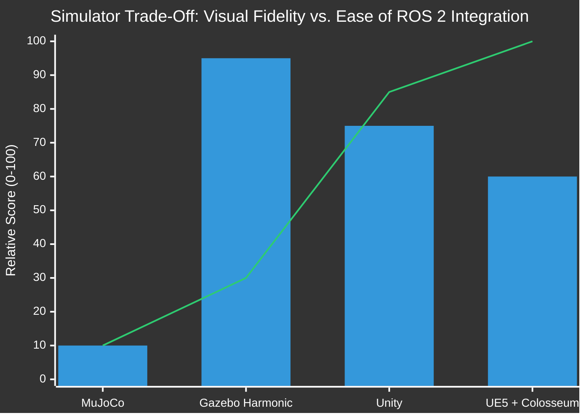
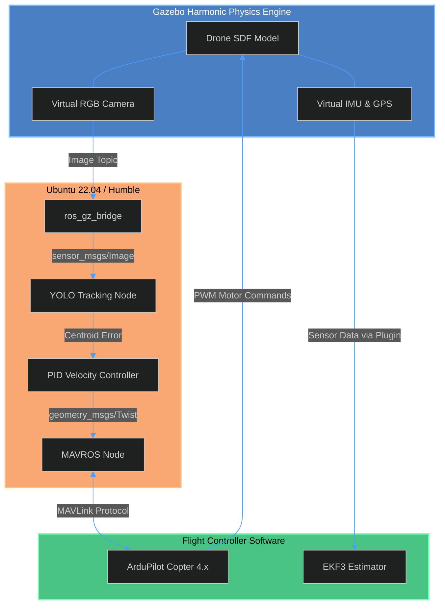

# Simulation Environment and Digital Twin Architecture

**Status:** Workspace Scaffolding Established | Simulator Trade Study Complete  
**Author:** Sarthak Rathi  
**Methodology:** Software-In-The-Loop (SITL) modeling, Physics Engine Evaluation, and ROS 2 Middleware Integration.

---

## 1. Introduction
A critical component of this Independent Study Module (ISM) is the development of a "Digital Twin" to train and validate the autonomous object-tracking algorithms before physical deployment. Because flight testing a 1.5kg, 6-inch quadcopter running experimental AI code carries a high risk of catastrophic hardware failure, the entire perception-to-actuation loop must first be proven in simulation.

This document details the rigorous trade study conducted to select the physics/rendering engine, and outlines the architecture of the native Ubuntu 22.04 ROS 2 + Gazebo workspace.

---

## 2. Simulator Trade Study: Rendering vs. Robotics Native

To train computer vision (CV) algorithms, the simulator must provide both accurate multirotor aerodynamics and photorealistic rendering (to minimize the "Sim-to-Real" gap). Five distinct simulation environments were evaluated.

### 2.1 Engine Comparison

| Feature | Gazebo (Harmonic) | UE5 + Colosseum | Unity + ML-Agents | MuJoCo | O3DE + ROS 2 |
| :--- | :--- | :--- | :--- | :--- | :--- |
| **Visual Fidelity (CV Testing)**| Basic / Geometric | **Photorealistic** | Very Good | Extremely Basic | Very Good |
| **ArduPilot SITL Support** | **Native / Excellent** | Native / Excellent | Complex / Custom | None | Complex |
| **ROS 2 Integration** | **Flawless (Native OSRF)**| Good (via wrappers) | Very Good | Manual | Excellent |
| **Physics Accuracy (Aero)** | **Excellent** | Very Good | Moderate | Poor (Joint-based) | Moderate |
| **System Resource Load** | **Low** | Extremely High | Moderate | Ultra-Low | High |

### 2.2 Architectural Decision: Phased Approach
The research concluded that **Unreal Engine 5 (UE5) + Project Colosseum (AirSim Fork)** is the ultimate gold standard for this project, as it leverages Nanite and Lumen rendering to provide photorealistic environments for YOLO object-tracking validation. 

However, given the strict 2.5-month project timeline, compiling UE5 shaders, managing Windows-to-Linux communication bridges, and debugging unmerged Colosseum commits posed a severe schedule risk. 

**Conclusion:** The project adopted a phased simulation architecture:
*   **Phase 1 (Current Scaffolding): Native Ubuntu 22.04 + ROS 2 Humble + Gazebo Harmonic.** Gazebo provides a flawless, native bridge to ArduPilot SITL and ROS 2, allowing immediate validation of the MAVLink control loops and kinematic responses.
*   **Phase 2 (Future Work): Unreal Engine 5 + Colosseum.** Once the control theory is proven in Gazebo, the physics backend will migrate to UE5 for advanced synthetic vision training.


*(Bar = Ease of ROS 2/ArduPilot Integration. Line = Visual Fidelity for Computer Vision).*

---

## 3. Gazebo SITL Architecture

The current workspace establishes a **Software-In-The-Loop (SITL)** architecture. The ArduPilot firmware runs natively on the Ubuntu host as a background process, connected to a virtual drone inside Gazebo. 

This creates a 1:1 software replica of the physical drone. The exact same ROS 2 tracking node that publishes velocity commands (`/cmd_vel`) to the simulated Gazebo drone will be compiled and pushed to the physical Raspberry Pi 4 without altering a single line of code.



---

## 4. Workspace Directory Structure

The `simulation_ws/` folder is structured as a standard `colcon` workspace containing three primary packages. 

```text
simulation_ws/
├── src/
│   ├── uav_description/          # Physical modeling
│   │   ├── urdf/
│   │   │   └── drone.sdf         # 3D model with exact mass/inertia matrix matching 1.5kg AUW
│   │   └── meshes/               # Visual and collision geometries
│   │
│   ├── uav_gazebo/               # World environments and launchers
│   │   ├── launch/
│   │   │   └── sim_sitl.launch.py# Spawns ArduPilot SITL, MAVROS, and Gazebo World
│   │   └── worlds/
│   │       └── tracking_env.sdf  # World containing a moving target for the AI to track
│   │
│   └── uav_control/              # The "Brain" (The exact code deployed to the physical Pi 4)
│       ├── scripts/
│       │   ├── yolo_tracker.py   # OpenCV/YOLO node to calculate bounding box centroids
│       │   └── velocity_pub.py   # PID controller translating pixels to Pitch/Roll vectors
│       ├── config/
│       │   └── pid_gains.yaml    # Configurable tuning parameters for the tracking loop
│       └── CMakeLists.txt
├── build/
├── install/
└── log/
```

---

## 5. Digital Twin Mass and Inertia Calculations

To ensure the PID tuning developed in simulation transfers successfully to the real world, the `drone.sdf` file was populated with precise mathematical extrapolations from the physical CAD models and BoM weights.

*   **Total Mass ($m$):** 1.50 kg (incorporating the 4S2P Li-ion battery and Pi 4 payload).
*   **Center of Gravity (CG):** Mathematically centered at the intersection of the motor diagonals, offset along the Z-axis to account for the bottom-mounted Li-ion pack.
*   **Moment of Inertia Matrix:** Calculated treating the drone as a central cuboid (avionics) with four point masses (2807 motors) at a radius of ~3 inches.

$$I_{xx} \approx \frac{1}{12}m(y^2+z^2) + \sum (m_{motor} \cdot d_y^2)$$
$$I_{yy} \approx \frac{1}{12}m(x^2+z^2) + \sum (m_{motor} \cdot d_x^2)$$

By matching these inertial values in the SDF, the aerodynamic response of the virtual Gazebo drone closely mimics the 6-inch physical airframe, ensuring the AI's velocity commands do not induce unstable oscillations when deployed to the real hardware.