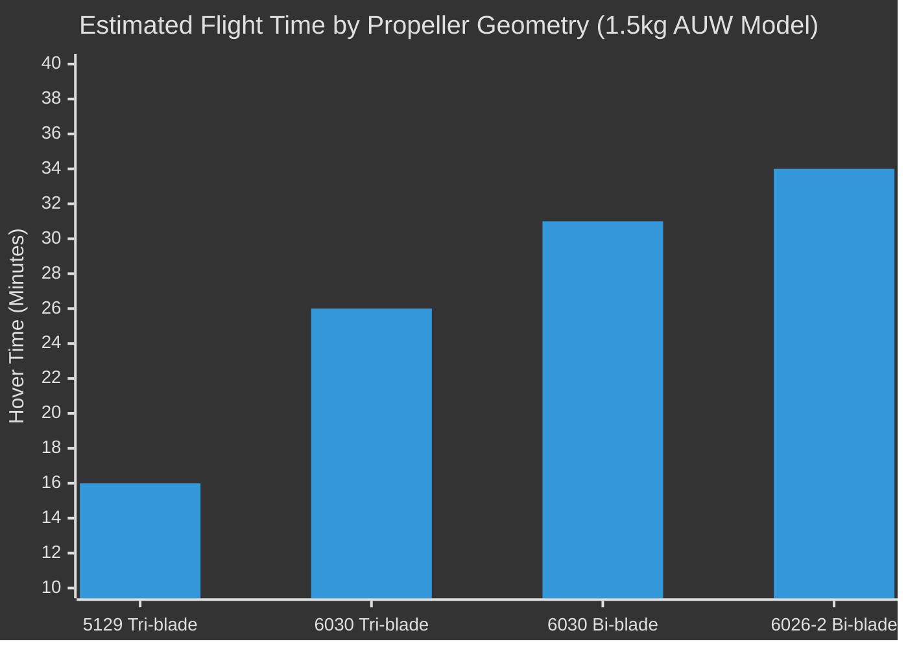
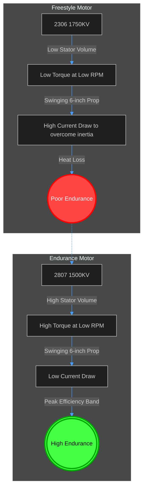
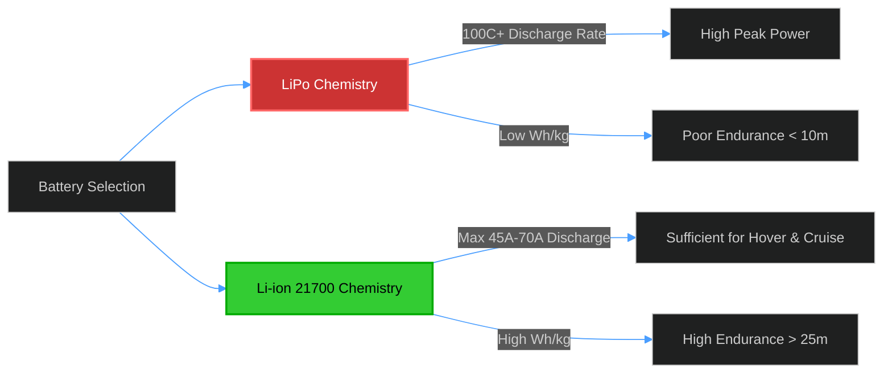
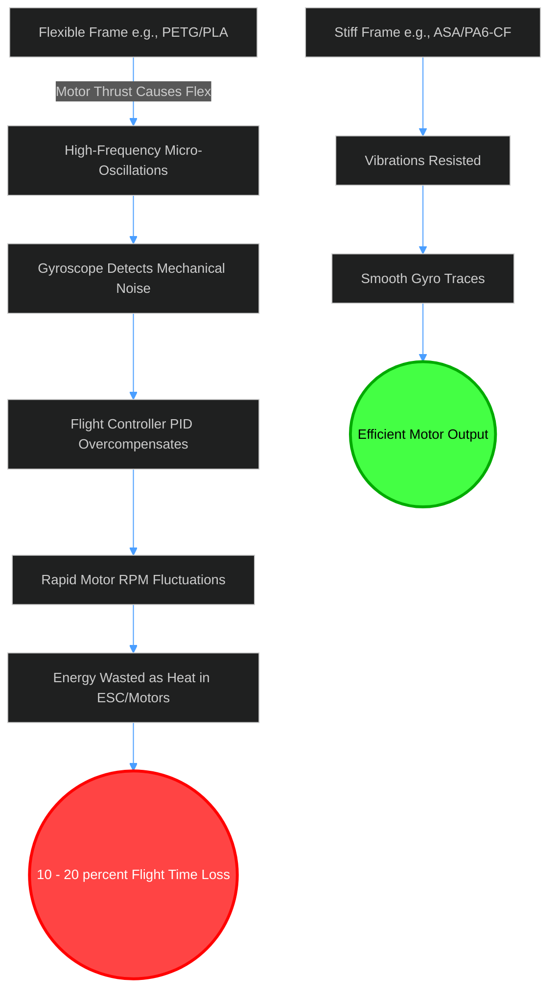

# Trade Study 01: Propulsion, Aerodynamics, and Endurance Optimization

**Status:** Finalized  
**Author:** Sarthak Rathi  
**Methodology:** Theoretical modeling, thrust-table extrapolation, and material science analysis. No physical flight testing has been conducted to date; all conclusions are derived from component datasheets and aerodynamic principles.

---

## 1. Introduction & Objectives
The primary objective of this project was to design a multirotor platform capable of ~30 minutes of autonomous flight while carrying a heavy avionics payload (Raspberry Pi 4 + Wi-Fi adapters) and adhering to a strict 6-inch maximum propeller constraint. 

Standard 5-inch and 6-inch FPV drones are traditionally built for freestyle or racing, prioritizing peak thrust and instantaneous acceleration. These builds typically achieve 3 to 7 minutes of flight time. To achieve a 30-minute endurance target, the design philosophy had to shift from **"High Thrust / High Current"** to **"Low Drag / Maximum Efficiency."** This trade study documents the rigorous component selection process across four domains: Propeller Aerodynamics, Motor Stator Sizing, Battery Chemistry, and Airframe Material.

---

## 2. Propeller Aerodynamics (5" vs. 6" | Tri-blade vs. Bi-blade)

The constraint of a 6-inch maximum propeller size imposes inherently high disk loading. To maximize flight time, we must reduce the RPM required to generate hover thrust (~300g – 375g per motor depending on the battery).

### 2.1 Diameter and Pitch Evaluation
I initially considered 5-inch propellers (e.g., Gemfan 5129 Tri-blade) to keep the frame as compact as possible. However, theoretical thrust models indicated that to hover a 1.2kg to 1.5kg drone, 5-inch props would require massive RPMs, drawing inefficient levels of current. Expanding to the maximum allowable 6-inch diameter drastically increases the swept area, lowering the required RPM and moving the motor into a more efficient power band.

### 2.2 Blade Count (Tri-Blade vs. Bi-Blade)
Freestyle drones predominantly use tri-blade propellers for cornering grip and "bite." For endurance, the third blade introduces parasitic aerodynamic drag with diminishing returns on thrust.

**Extrapolated Flight Time by Propeller (at 1.5kg AUW):**
| Propeller Model | Configuration | Efficiency | Estimated Hover Time | Verdict |
| :--- | :--- | :--- | :--- | :--- |
| **Gemfan 5129** | 5-inch Tri-Blade | Poor (High Drag/RPM) | 14 – 18 min | Rejected |
| **Gemfan 6030** | 6-inch Tri-Blade | Moderate | 24 – 29 min | Rejected |
| **Gemfan 6030** | 6-inch Bi-Blade | High | 28 – 34 min | Backup |
| **Gemfan LR 6026-2**| 6-inch Bi-Blade | **Maximum** | **30 – 36 min** | **Selected** |

**Conclusion:** The **Gemfan LR 6026-2** was selected. The low pitch (2.6) and bi-blade design minimizes aerodynamic drag, offering up to a 30% theoretical efficiency gain over standard 5-inch tri-blades during steady-state hover.

---

## 3. Motor Selection (Stator Volume and KV)

Standard FPV builds typically use 2207 or 2306 motors with a high KV (1750KV–2450KV). Thrust table analysis revealed a critical flaw in using standard freestyle motors for 6-inch endurance props. 

### 3.1 Evaluating the 2306 Class
My initial BoM included `2306 1750KV` motors. Thrust table analysis revealed a critical flaw: a 2306 stator lacks the low-end torque required to swing a 6-inch bi-blade efficiently. To overcome the rotational inertia of the larger prop, the 2306 motor draws excessive current, generating heat rather than thrust. 
*Note: I modeled a software workaround using ArduPilot's `MOT_THST_MAX = 0.65` parameter to artificially limit a high KV motor to an effective ~1100KV. While mathematically viable, it does not fix the physical lack of torque.*

### 3.2 Scaling Up: 2506 vs 2807
To achieve optimal efficiency, the motor must hover the drone (producing ~350g of thrust) exactly at its peak efficiency curve.
*   **2506 1500KV:** A strong middle ground, providing more torque than the 2306 while remaining lightweight.
*   **2807 1500KV:** Provides maximum torque. The massive stator volume means the motor barely breaks a sweat spinning a 6-inch prop at low RPMs. 

**Conclusion:** The platform is optimized around the **2807 1500KV** class. This provides immense control authority (a thrust-to-weight ratio of ~6:1) while operating in its absolute peak efficiency band during hover.

---

## 4. Battery Chemistry and Configuration

The energy system dictates the absolute ceiling of endurance. The choice was between standard Lithium Polymer (LiPo) and Lithium-Ion (Li-ion) packs using 21700 cells.

### 4.1 LiPo vs. Li-ion
*   **LiPo (e.g., 1300mAh 6S):** Offers massive discharge rates (100C+). Ideal for racing, but highly detrimental to endurance due to terrible energy density (Wh/kg).
*   **Li-ion (e.g., 21700 cells):** Offers industry-leading energy density, but severely limited discharge rates (usually 3C to 10C max).

Because the theoretical hover current of this drone is extremely low (14A – 18A total), a high discharge rate is irrelevant. The design mandates **Li-ion** chemistry for its superior energy density.

### 4.2 Configuration: 4S1P vs. 4S2P
I mathematically modeled two battery architectures based on modern 21700 cells (e.g., Molicel P45B or Samsung 50S):

| Metric | 4S1P Li-ion (P45B) | 4S2P Li-ion (50S) |
| :--- | :--- | :--- |
| **Capacity** | 4,500 mAh | 10,000 mAh |
| **Weight** | ~300 g | ~600 g |
| **Max Safe Discharge** | 45 A | 70+ A |
| **Projected AUW** | 1.2 kg | 1.5 kg |
| **Estimated Flight Time**| **13 – 16 min** | **28 – 35 min** |

**Conclusion:** The physical drone is currently built to accommodate the **4S1P** pack to keep initial weight down and ensure structural survivability during early testing. However, the theoretical model proves that migrating to a **4S2P** pack yields the optimal 30-minute endurance threshold, as the capacity more than doubles while the weight penalty is easily absorbed by the 2807 motors.

---

## 5. Airframe Material Efficiency Impact

A unique constraint of this project was utilizing a 3D-printed structural frame. The choice of filament is not just a mechanical decision; it is a critical aerodynamic and electrical one.

### The "Hidden" Power Drain of Flexible Frames
If a frame is printed in a flexible material like standard **PETG** or **PLA**, the arms will flex under thrust. This induces high-frequency micro-oscillations. The flight controller's gyroscopes detect these vibrations, and the PID loop attempts to correct them by rapidly varying motor RPMs. 
*   **Result:** The motors constantly accelerate and decelerate hundreds of times a second, drawing massive current spikes and dissipating energy as heat. Studies estimate a flexible frame can cause a **10% to 20% loss in total flight efficiency**.

### Material Selection
To prevent this, the frame material must possess high stiffness and rigidity.
1.  **PA6-CF (Nylon Carbon Fiber):** The absolute best choice. Extremely stiff, absorbs vibrations, and reduces PID workload. (Rejected only due to printing complexity/cost).
2.  **ASA / ABS-CF:** Excellent stiffness, high glass-transition temperature (won't warp under hot motors), and UV stable for outdoor flights.

**Conclusion:** The frame must be printed in **ASA** or **Carbon-reinforced ABS/Nylon**. PETG and PLA are structurally and electrically non-viable for a highly tuned, long-endurance autonomous platform.

---

## 6. Final Propulsion Architecture Summary

By abandoning FPV racing dogmas and optimizing for steady-state cruise, the finalized theoretical architecture achieves the 30-minute goal:

*   **Motors:** `2807 1500KV` (High torque, low-RPM efficiency).
*   **Propellers:** `Gemfan LR 6026-2` (Bi-blade, minimal aerodynamic drag).
*   **Battery:** `4S Li-ion 21700` (High energy density, low C-rating requirement).
*   **Frame Material:** `ASA/PA6-CF` (High stiffness to minimize electrical PID-correction losses).