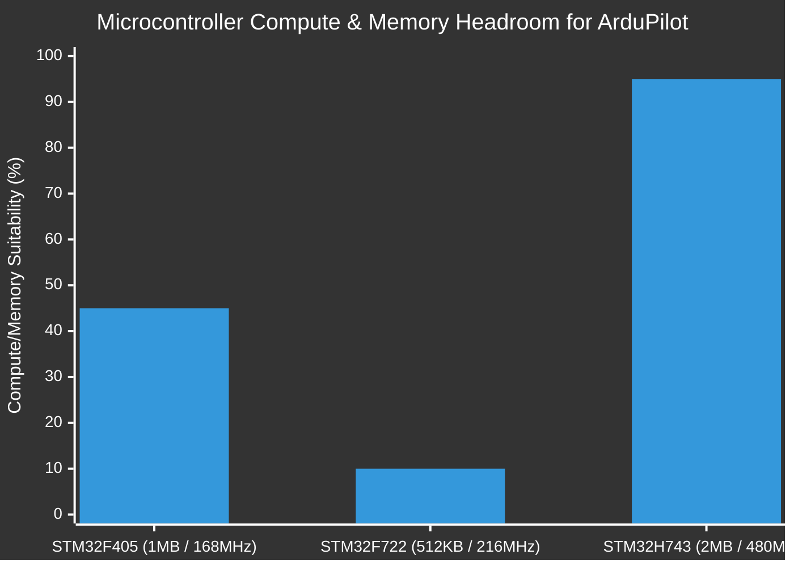
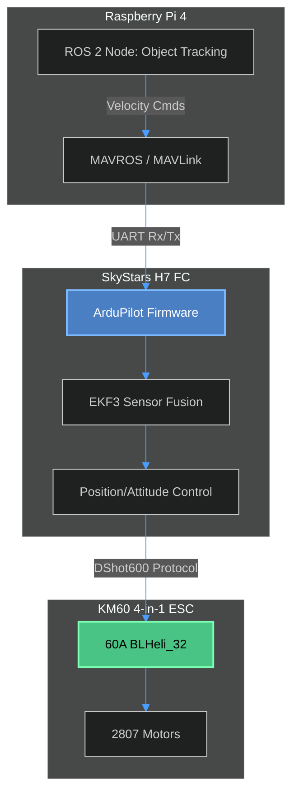

# Trade-off Study 02: Flight Controller Stack, Firmware, and Avionics

**Status:** Finalized  
**Author:** Sarthak Rathi  
**Methodology:** Systems architecture evaluation, silicon limitation analysis (Flash/RAM mapping), and protocol compatibility testing for ROS 2 integration. 

---

## 1. Introduction & Objectives
The "brain" of the UAV consists of the Flight Controller (FC) hardware and its embedded firmware. Standard 6-inch drones typically utilize racing stacks (Betaflight) designed for manual control. However, this project requires a research-grade avionics package capable of executing autonomous MAVLink commands generated by an onboard companion computer (Raspberry Pi 4) / ground station via ROS 2.

The objective of this trade-off study is to navigate the complex intersection of **Firmware Capabilities**, **Microcontroller (MCU) Silicon Limitations**, and **Physical Packaging** to select the optimal Flight Controller and peripheral stack.

---

## 2. Firmware Architecture Evaluation

The choice of firmware dictates the entire software pipeline, from the ground station to the companion computer. Four primary open-source flight stacks were evaluated.

### 2.1 Capability Comparison

| Feature | Betaflight | INAV | PX4 Autopilot | ArduPilot |
| :--- | :--- | :--- | :--- | :--- |
| **Primary Use Case** | Manual FPV / Racing | GPS FPV / Cruising | Research / Robotics | Robotics / Hobbyist |
| **Control Loop Latency** | Ultra-low (<1ms) | Low | Moderate | Moderate |
| **MAVLink Support** | Extremely Limited | Basic | **Native & Robust** | **Native & Robust** |
| **Offboard AI Control** | RC Overrides Only | Waypoints only | **Full API** | **Full API** |
| **Companion PC Routing**| None | Poor | **Excellent** | **Excellent** |

### 2.2 Decision Matrix
*   **Betaflight & INAV:** Rejected. While they offer excellent manual flight performance, they lack the bidirectional MAVLink APIs required for a Raspberry Pi running ROS 2 to inject real-time velocity vectors or position targets.
*   **PX4 vs. ArduPilot:** Both are heavyweights in the autonomous robotics sector. **ArduPilot (Copter)** was ultimately selected for this build due to its broader support for compact FPV-style hardware boards and its highly mature hardware-in-the-loop (SITL) integration with Gazebo.

---

## 3. Flight Controller Hardware (Silicon Constraints)

Running advanced firmware like ArduPilot on 30x30mm FPV-style boards introduces severe silicon constraints. ArduPilot relies heavily on Extended Kalman Filters (EKF3) and redundant sensor logging, demanding significant Flash memory and RAM.

### 3.1 The 1MB Flash Limitation (F405 vs. H743)
Many popular budget FPV stacks (such as the SpeedyBee F405 V3/V4) utilize the STM32F405 microcontroller. 
*   **The F405 Problem:** The STM32F405 contains only **1MB of Flash memory**. Modern ArduPilot builds exceed 1.2MB. To run ArduPilot on an F405, the firmware must be compiled as a "stripped" target—removing LUA scripting, advanced EKF features, and specialized peripheral drivers. 
*   **The H7 Solution:** STM32H7-class processors (e.g., H743) feature **2MB of Flash** and run at 480MHz, providing compute headroom for sensor fusion and dual-gyro filtering without sacrificing features.

*Note: The F722 chip is practically obsolete for ArduPilot due to its 512KB flash limit, despite its faster clock speed.*

### 3.2 Form Factor Selection (Pixhawk vs. FPV Stacks)
Traditional autonomous drones use boards like the **Holybro Pixhawk 2.4.8**. While excellent, Pixhawk boards are bulky, heavy, and require external Power Distribution Boards (PDBs) and standalone ESCs. 

To maintain the 1.5kg AUW endurance limit on a 6-inch frame, a **30x30mm 4-in-1 Stack** (combining the FC and the ESC into a compact tower) is ideal.

### 3.3 Final FC Selection
The **SkyStars H7 Dual Gyro FC + KM60 60A BLHeli_32 ESC** was selected over alternatives like the SpeedyBee and Matek equivalents.
*   **Processor:** STM32H7 (Supports full, unstripped ArduPilot firmware).
*   **Sensors:** Dual Gyros (allows hardware-level vibration filtering, critical for a 3D-printed frame) and an onboard Barometer.
*   **I/O:** 8 hardware UARTs, providing ample ports for GPS, ELRS, telemetry to the Pi 4, and future sensors (LiDAR/Optical Flow).
*   **Power:** The integrated 60A ESC vastly exceeds the ~20A total hover requirement, guaranteeing thermal safety.

---

## 4. Peripherals and Communications

To support the ArduPilot ecosystem, the peripheral layout must prioritize digital serial communication over legacy analog/PWM protocols.

### 4.1 Radio Receiver (CRSF vs. PWM)
The control link required a rigorous evaluation between receiver geometries. 
*   **Radiomaster ER6 and similar (Rejected):** The ER6 is a PWM-based receiver designed for fixed-wing aircraft. It outputs physical PWM signals to drive individual servos, making it incredibly bulky and virtually useless for a modern quadcopter flight controller that expects a multiplexed serial input.
*   **Radiomaster RP4TD-M (Selected):** This is a micro-sized **True Diversity** serial receiver. It communicates with the FC using the high-speed CRSF (Crossfire) protocol over a single UART. The dual-antenna diversity ensures the 2.4GHz control link remains unbroken even if the drone's carbon/plastic frame blocks one antenna during maneuvering.

### 4.2 GPS & Magnetometer
Autonomous multirotors rely heavily on accurate heading data. While gyroscopes provide relative yaw, they drift over time. 
*   **HGLRC M100 Pro GPS (Selected):** Features the modern U-Blox M10 chipset for rapid 3D satellite locking. Crucially, this unit **includes an integrated magnetometer (compass).** Without an external compass mounted away from the electromagnetic noise of the high-current ESC, ArduPilot cannot reliably execute autonomous positional holding ("Loiter") or waypoint tracking, leading to dangerous "toilet-bowling" behavior.

---

## 5. Architectural Conclusion

By mapping the software requirements (ROS 2 MAVLink routing) to the physical hardware limits, the optimal avionics package was finalized. The stack avoids the common pitfalls of stripping firmware to fit budget FPV chips or utilizing bulky legacy autopilots. 

**Final Avionics Architecture:**
1.  **Firmware:** ArduPilot (Copter)
2.  **Flight Controller:** SkyStars H7 Dual Gyro (STM32H7, 2MB Flash)
3.  **Actuation:** KM60 60A 4-in-1 BLHeli_32 ESC
4.  **Control Link:** ExpressLRS 2.4GHz via Radiomaster RP4TD-M (CRSF Serial)
5.  **Navigation:** HGLRC M100 Pro (M10 GPS + Compass via UART/I2C)