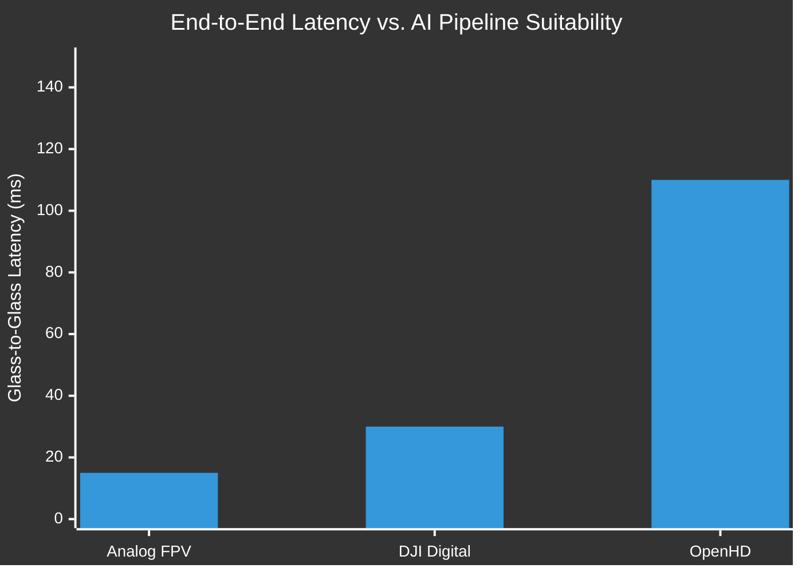
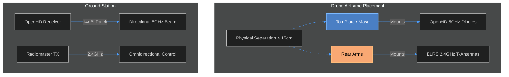

# Trade-off Study 03: Communication Architecture, RF Design, and AI Integration

**Status:** Finalized  
**Author:** Sarthak Rathi  
**Methodology:** RF propagation analysis, network protocol evaluation, and bandwidth/latency modeling. 

---

## 1. Introduction & Objectives
A standard FPV multirotor utilizes three distinct, single-purpose radio links: an analog video transmitter (VTX), a control receiver (RX), and a telemetry radio. 

For an autonomous object-tracking drone, the ground station (or onboard companion computer) requires a pristine, uncompressed, or cleanly encoded digital video feed to run OpenCV and YOLO-based AI algorithms. Analog video is highly susceptible to multipath interference and static, which drastically degrades computer vision accuracy. 

The objective of this trade-off study is to evaluate video transmission systems, select the optimal network architecture for AI integration, and design an antenna layout that prevents cross-band interference between the video, telemetry, and control links.

---

## 2. Video Link & Telemetry Architecture

To feed an AI model, the video link must output digital frames (H.264/H.265) directly to a Linux environment without requiring lossy analog-to-digital capture cards. 

### 2.1 System Evaluation

| Feature | Analog FPV (5.8GHz) | DJI O4 / Walksnail (Digital) | OpenHD (5GHz Wi-Fi Broadcast) |
| :--- | :--- | :--- | :--- |
| **Video Format** | Composite (NTSC/PAL) | Proprietary Encoded | **H.264 Digital Stream** |
| **AI Integration** | Poor (Requires Capture Card) | Very Poor (Closed Ecosystem) | **Excellent (Direct to ROS 2)** |
| **Latency** | **~10-20 ms** | ~20-40 ms | ~100-120 ms |
| **Telemetry** | OSD Overlay Only | OSD Overlay Only | **Bi-directional MAVLink** |
| **Verdict** | Rejected | Rejected | **Selected** |

**Conclusion:** **OpenHD** was selected. While its latency (~110ms) is too high for acrobatic drone racing, it is well within acceptable margins for smooth, autonomous cruising and object tracking. OpenHD replaces the traditional VTX entirely, utilizing Wi-Fi adapters injected in "Monitor Mode" to broadcast H.264 video and MAVLink telemetry concurrently over the 5GHz band.

---

## 3. OpenHD Hardware Selection

OpenHD requires compatible Wi-Fi network interface cards (NICs) on both the air unit (Raspberry Pi 4) and the ground station (Ubuntu PC). 

### 3.1 Chipset Analysis (RTL8812EU)
The build utilizes the **LB-LINK BL-M8812EU2** module. 
*   **Protocol:** 802.11a/n/ac (5GHz).
*   **MIMO:** 2x2 (Two transmit, two receive chains).
*   **Chipset:** RTL8812EU. While OpenHD historically recommended the older `RTL8812AU` chips, the `EU` variant is a highly potent, cost-effective modern alternative fully supported by recent OpenHD kernel drivers. It provides physical PHY rates up to 867 Mbps, vastly exceeding the ~10 Mbps required for a 1080p video stream.

*Critical Design Note:* Because the BL-M8812EU2 is a bare-board module (not a USB dongle), it interfaces directly via USB D+/D- pins. It draws up to **1.8A peak** during high-power transmission and must be powered by the dedicated 5A XL4015 buck converter, not the Raspberry Pi's internal USB bus, to prevent voltage sags and module resets.

---

## 4. RF Engineering & Antenna Selection

A frequent point of failure in custom OpenHD builds is the misapplication of traditional FPV antennas to Wi-Fi hardware. 

### 4.1 Polarization: Circular vs. Linear
Standard analog FPV systems use **Circularly Polarized (CP)** antennas (e.g., Pagodas, Lollipops) to reject multipath interference in tight environments. 
Wi-Fi radios, however, are engineered for **Linearly Polarized (LP)** antennas (dipoles, patches). Attaching a circular FPV antenna to a linear Wi-Fi adapter results in an immediate **-3dB cross-polarization loss** (effectively halving the signal power).

**Selection:** Standard 5GHz Wi-Fi dipole antennas were mandated.

### 4.2 Air Unit (Drone) Antenna Layout
The RTL8812EU module has two IPEX/U.FL connectors. **Both must be populated** to prevent burning out the internal power amplifiers.
*   **Selection:** Two 5GHz Omnidirectional Rubber-Duck Dipoles (3–5 dBi gain).
*   **Placement:** Mounted at a **90-degree offset** (one vertical, one horizontal). This leverages the 2x2 MIMO architecture to achieve *polarization diversity*. As the drone banks and pitches during flight, at least one antenna remains optimally aligned with the ground station.

### 4.3 Ground Station Antenna Layout
To maximize range and signal penetration, the ground station utilizes an asymmetrical antenna configuration (Antenna Diversity):
*   **Antenna 1 (Omnidirectional):** A 5 dBi dipole to maintain connection when the drone is flying directly overhead or at close ranges.
*   **Antenna 2 (Directional):** A 14 dBi Panel/Patch antenna pointed toward the flight area. Directional antennas flatten the radiation pattern, drastically increasing forward range (easily supporting 2km+ links) at the cost of vertical coverage.

---

## 5. Frequency Management and Interference Mitigation

The drone utilizes two separate, powerful radio systems. If they operate on adjacent frequencies or are physically too close, the "noise floor" of one will drown out the receiver of the other (desensitization).

*   **Video & Telemetry (OpenHD):** 5GHz Band (~5.15 – 5.85 GHz).
*   **Manual RC Override (ELRS):** 2.4GHz Band.

### Safety Architecture: Why Keep ELRS?
OpenHD *can* route RC joystick commands through the Wi-Fi link. However, relying on a high-bandwidth, high-latency Linux video pipeline for critical flight control introduces a single point of failure. 
By maintaining the **Radiomaster RP4TD-M ExpressLRS (2.4GHz)** receiver, the drone possesses an independent, ultra-low latency (250Hz), hardware-level control link. If the Raspberry Pi crashes, the Wi-Fi link drops, or the object-tracking AI behaves erratically, the pilot retains instantaneous manual override to switch the flight controller to a safe mode (e.g., Position Hold or Return-to-Launch).

---

## 6. Conclusion: Final Communications Topology

The finalized communication architecture provides a robust, dual-band network tailored specifically for autonomous computer vision workloads:

1.  **AI Video & Telemetry Payload:** Encapsulated in OpenHD over a 2x2 MIMO 5GHz Wi-Fi broadcast, utilizing spatial diversity on the drone and directional gain on the ground to ensure a pristine digital feed.
2.  **Command and Control (C2):** Handled independently by ELRS on 2.4GHz, ensuring uninterrupted pilot-in-command safety.
3.  **Antenna Layout:** Strictly linearly polarized antennas, separated physically on the airframe to completely eliminate RF desensitization. 