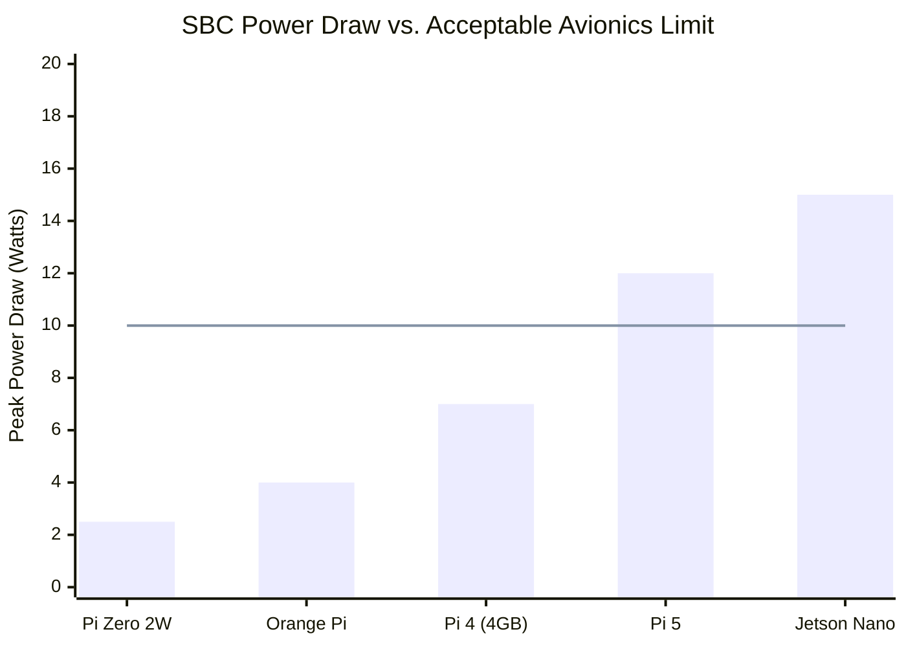
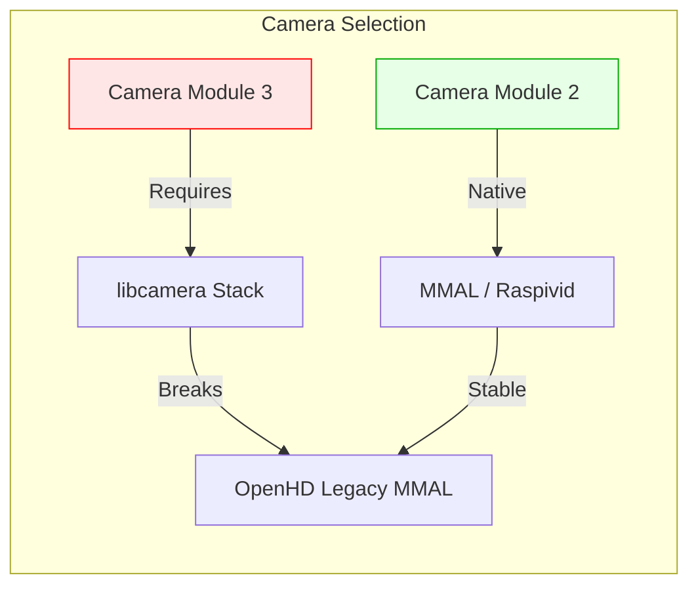
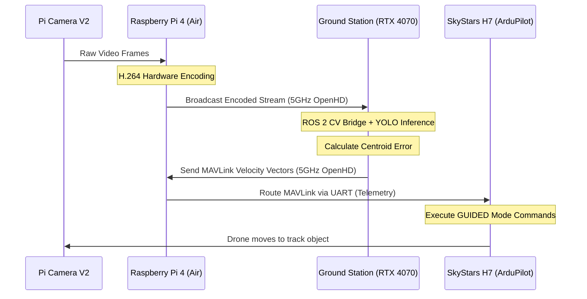

# Trade Study 04: Companion Computer, Vision Sensors, and AI Pipeline

**Status:** Finalized  
**Author:** Sarthak Rathi  
**Methodology:** SWaP (Size, Weight, and Power) analysis, software ecosystem compatibility mapping, and computer vision latency modeling.

---

## 1. Introduction & Objectives
In an autonomous object-tracking drone, the Companion Computer (CC) acts as the high-level brain. It is responsible for bridging the flight controller (ArduPilot) to the external world by handling hardware-accelerated video encoding, routing MAVLink telemetry, and executing or forwarding Computer Vision (CV) workloads via ROS 2.

Integrating a CC on a 6-inch multirotor introduces strict **SWaP (Size, Weight, and Power)** constraints. The objective of this trade study is to select a Single Board Computer (SBC) and camera sensor that provide enough compute headroom for the OpenHD digital video pipeline and AI integration, without exceeding the payload capacity or thermal limits of the airframe.

---

## 2. Companion Computer (SBC) Evaluation

The CC must continuously encode 1080p or 720p video to H.264 while managing network protocols. I evaluated several SBCs against the system's 1.5 kg AUW and ~15W avionics power limit.

### 2.1 Hardware Candidates

| SBC Candidate | RAM | Peak Power | Weight (w/o heatsink) | AI Capability | Verdict |
| :--- | :--- | :--- | :--- | :--- | :--- |
| **Raspberry Pi Zero 2W** | 512 MB | ~2.5 W | 15 g | Very Poor | Rejected (Too weak) |
| **Orange Pi Zero 2** | 1 GB | ~4.0 W | 30 g | Poor | Rejected (Driver issues) |
| **Raspberry Pi 4 Model B**| **4 GB** | **~7.0 W** | **46 g** | **Moderate** | **Selected** |
| **Raspberry Pi 5** | 4-8 GB | ~12.0 W | 46 g | High | Rejected (Software incompat.)|
| **Nvidia Jetson Nano** | 4 GB | ~15.0 W | >140 g | Excellent | Rejected (Too heavy/power hungry) |

### 2.2 Why Not the Pi Zero 2W?
My initial BoM included the Pi Zero 2W to save weight. However, while it *can* run OpenHD, its 512MB of RAM creates a severe bottleneck. Once the OS and OpenHD video encoder allocate memory, there is virtually zero RAM left for running ROS 2 nodes or onboard tracking scripts, leading to system crashes.

### 2.3 The "Pi 5" Software Compatibility Paradox
Logically, the newest and most powerful Raspberry Pi 5 should be the best choice. However, it was explicitly rejected due to **software ecosystem immaturity**. 
OpenHD historically relies on the proprietary Broadcom `MMAL` (Multi-Media Abstraction Layer) pipeline and the hardware H.264 encoder built into the VideoCore IV/VI GPUs of the Pi 3 and Pi 4. The Raspberry Pi 5 completely removed this legacy hardware encoder and shifted to a new software/hardware architecture. Consequently, OpenHD does not officially or stably support the Pi 5 yet.

*(The line at 10W represents the optimal target maximum power draw for a 6-inch quad's CC to preserve flight time).*

**Conclusion:** The **Raspberry Pi 4 (4GB)** is the indisputable "sweet spot." It offers robust OpenHD support via hardware encoding, enough RAM to host ROS 2 middleware, and manageable power/weight profiles.

---

## 3. Vision Sensor Selection (Camera Module)

For computer vision and object tracking, the camera is not just a lens; it is a measurement instrument. The camera must provide a deterministic, low-latency feed.

### 3.1 Pi Camera Module 2 vs. Module 3
*   **Camera Module 3:** Features a 12MP Sony IMX708 sensor, HDR, and **Autofocus**.
*   **Camera Module 2:** Features an 8MP Sony IMX219 sensor and **Fixed Focus**.

While the Module 3 has superior image quality, it was **rejected** for two critical engineering reasons:
1.  **Autofocus Hunting:** In a high-vibration drone environment, autofocus logic constantly "hunts" to maintain sharpness. This introduces non-deterministic latency and blurring, which destroys the bounding-box consistency of object-tracking algorithms (like YOLO). Fixed focus ensures optical consistency.
2.  **Software Stack (`libcamera`):** Camera Module 3 requires the modern `libcamera` stack. As discussed in the SBC evaluation, OpenHD relies on the legacy MMAL video pipeline. `libcamera` integration in OpenHD is currently highly experimental and prone to crashing. 

**Conclusion:** The **Raspberry Pi Camera Module 2** was definitively selected. It provides plug-and-play compatibility with OpenHD and ensures a consistent, fixed focal plane for the tracking AI.

---

## 4. The Distributed AI Architecture

With the CC and Camera finalized, the architectural flow of the autonomous tracking system was mapped out. 

Given the 7-week project timeline and the limited compute headroom of the Pi 4 (after video encoding overhead), executing heavy neural networks (e.g., YOLOv8) onboard the drone is risky. Therefore, the architecture utilizes a **Distributed AI Pipeline**, offloading the heavy computer vision inference to the ground station.

### 4.1 Data Flow Pipeline
1.  **Perception:** The Pi Camera captures frames. The Pi 4 hardware encodes them to H.264.
2.  **Transmission:** OpenHD broadcasts the digital frames over the 5GHz Wi-Fi link.
3.  **Inference (Ground Station):** The Ground Station (running Ubuntu and an RTX 4070 GPU) receives the stream. A ROS 2 node ingests the frames, runs YOLO object detection, and calculates the target's centroid offset.
4.  **Command:** A ROS 2 control node translates the centroid offset into MAVLink velocity commands (Pitch/Roll/Yaw) and routes them back through the OpenHD Wi-Fi link.
5.  **Actuation:** ArduPilot on the SkyStars H7 executes the velocity commands to center the target in the frame.

---

## 5. Conclusion
The selection of the **Raspberry Pi 4 (4GB)** and the **Pi Camera Module 2** represents the safest, most reliable path for achieving a digital video link on a research drone. By respecting the software limitations of the OpenHD ecosystem (avoiding the Pi 5 and `libcamera`) and adopting a Distributed AI architecture, the drone's onboard compute load is optimized. This setup minimizes thermal output and power consumption, directly supporting the project's primary 30-minute endurance goal.