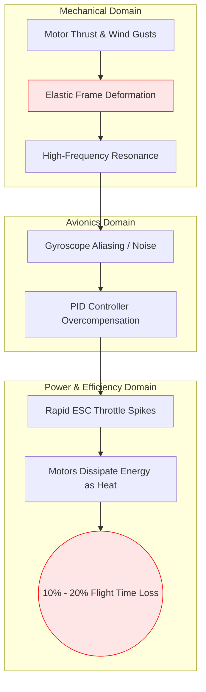
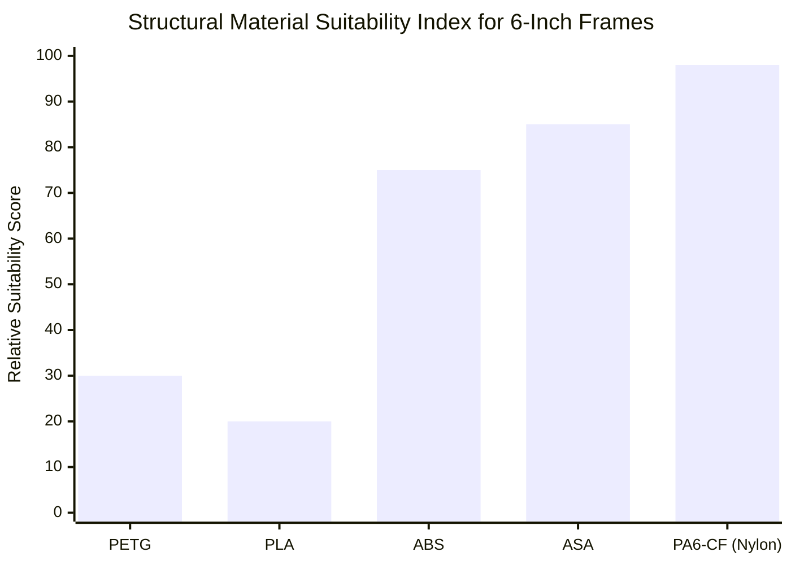
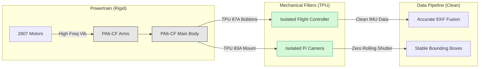

# Structural Analysis and Material Trade Study

**Status:** Finalized  
**Author:** Sarthak Rathi  
**Methodology:** Mechanical resonance modeling, material property comparison (Tensile Strength / Modulus / Thermal Resistance), and payload vibration analysis.

---

## 1. Introduction: The Frame as an Active Electrical Component
In a standard multirotor build, the frame is often viewed merely as a static chassis holding the components together. Traditional frames use 3mm to 5mm carbon fiber plates, which are exceptionally rigid. However, this project is constrained to a **3D-printed structural frame**. 

When scaling to a 6-inch propeller with an All-Up Weight (AUW) of ~1.5 kg, the choice of 3D printing filament is not just a mechanical decision—it is a critical electrical and aerodynamic one. A frame that lacks sufficient stiffness directly sabotages the drone's endurance and computer vision capabilities. This document outlines the material selection process required to mitigate these structural risks.

---

## 2. The "Hidden" Electrical Drain of Frame Flex
Standard thermoplastic filaments like PETG or PLA exhibit significant elastic deformation under load. When a drone weighing 1.5 kg maneuvers or holds a hover in turbulent air, the 6-inch propellers generate thrust vectors that bend the drone's arms. 

This mechanical flex induces high-frequency micro-oscillations throughout the airframe. The flight controller's gyroscopes detect this flex as uncommanded movement. The PID loop attempts to correct it by commanding the ESCs to rapidly surge and brake the motors. 

**The Result:** The motors oscillate wildly, converting battery energy into heat rather than thrust. Research indicates that a highly flexible frame on a 6-inch drone can cause a **10% to 20% loss in total flight efficiency**, negating the benefits of an optimized endurance powertrain.

---

## 3. Comprehensive Material Comparison
To prevent PID-induced power drain, the chosen filament must possess a high Young's Modulus (stiffness), high interlayer adhesion, and a Glass Transition Temperature (Tg) capable of withstanding the heat generated by 2807 motors (often exceeding 60°C).

### 3.1 Material Viability Matrix

| Material | Stiffness / Rigidity | Impact Resistance | Thermal Resist. (Tg) | UV Resistance | Verdict |
| :--- | :--- | :--- | :--- | :--- | :--- |
| **PLA (Standard)** | High | Very Low (Brittle) | **Fail** (~55°C) | Poor | Rejected |
| **PETG** | **Fail** (Too Flexible) | High | Marginal (~75°C) | Moderate | Rejected |
| **ABS / ASA** | High | Moderate | Good (~100°C) | **Excellent (ASA)**| Acceptable |
| **PA6-CF / PA6-GF** | **Maximum** | High | **Excellent** (>150°C)| Good | **Optimal** |

### 3.2 Analysis of Candidates
*   **PETG:** Despite its excellent impact resistance and ease of printing, PETG is far too ductile. A 6-inch drone printed in PETG will suffer from severe tuning issues, oscillation, and poor endurance.
*   **PLA / PLA-CF:** While stiff, PLA deforms under low heat. A 2807 motor operating during a 30-minute endurance flight will easily heat up past PLA's glass transition temperature (55°C), causing the motor mounts to melt mid-flight.
*   **ASA (Acrylonitrile Styrene Acrylate):** The ideal baseline. It possesses the stiffness and thermal resistance of ABS but adds exceptional UV stability for outdoor flights. 
*   **PA6-CF (Carbon Fiber Nylon):** The absolute gold standard for printed drones. The infusion of chopped carbon fibers drastically increases the tensile modulus, creating a frame rigid enough to rival standard carbon fiber plates, completely eliminating flex-induced PID inefficiencies.

**Conclusion:** The primary structural frame and arms should be manufactured from **PA6-CF** (or PA6-GF). If carbon-nylon is unavailable due to printing constraints, **ASA** is the minimum acceptable alternative. 

---

## 4. Vibration Isolation and Computer Vision

While the structural frame must be exceptionally rigid, the sensitive payloads must be mechanically decoupled from the powertrain. 

The onboard AI pipeline relies on a Raspberry Pi Camera Module V2 tracking bounding boxes. High-frequency motor noise transmitted directly to the camera sensor causes "Rolling Shutter" artifacts (Jello). This visual distortion destroys the accuracy of edge-detection and object-tracking algorithms (e.g., YOLO, CSRT).

### 4.1 TPU Implementation Strategy
Thermoplastic Polyurethane (TPU) is utilized exclusively for dampening and mounting, using different Shore Hardness ratings based on the application:

*   **TPU 95A (Stiff Flexible):** Used for mounting antennas (ELRS T-antennas, Wi-Fi Dipoles) and landing skids. It holds components firmly in the slipstream without shattering upon impact.
*   **TPU 87A / 83A (Ultra Soft):** Used explicitly for the Flight Controller bobbins and the Pi Camera mount. This durometer acts as a mechanical low-pass filter, isolating the gyroscopes and the CMOS sensor from the rigid frame's mechanical noise.

---

## 5. Design Considerations for 3D Printing

To extract maximum strength-to-weight performance from the selected materials, the CAD models and slicing parameters must follow specific aerospace-oriented guidelines:

1.  **Infill Patterns:** Arms should *not* be printed solid (100% infill), as this unnecessarily increases the AUW (every +100g reduces flight time by ~1–2 minutes). Instead, use a **Gyroid** or **Cubic** infill at 40-60%. These 3D geometries provide isotropic rigidity while saving weight.
2.  **Wall Thickness:** Strength in 3D printed parts comes from perimeters, not infill. The frame arms should utilize a minimum of **5 to 6 perimeters (walls)**.
3.  **Threadlocker Warning:** Standard anaerobic threadlockers (like Loctite Blue) chemically attack and embrittle thermoplastics like ABS, ASA, and Polycarbonate. For securing motors to a 3D printed frame, mechanical locking mechanisms (nylon-insert locknuts) or plastic-safe adhesives must be used.

---

## 6. Conclusion
The structural integrity of a 6-inch autonomous UAV directly limits its software performance and flight endurance. By utilizing **PA6-CF or ASA** for the rigid frame assembly and **TPU 83A/95A** for selective vibration decoupling, the platform avoids the catastrophic PID-correction power drains associated with basic PETG/PLA prints. This guarantees a highly stable platform tailored specifically for long-endurance computer vision operations.