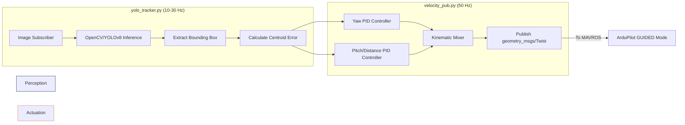

# Package: `uav_control`
**Status:** Tracking Pipeline Architecture and Control Theory Defined  
**Purpose:** Contains the ROS 2 nodes responsible for Computer Vision (YOLO/OpenCV) and closed-loop autonomous actuation. 

## 1. Overview
This package is hardware-agnostic. The exact same Python nodes developed here to control the Gazebo simulation will be deployed to the physical Ground Station / Raspberry Pi 4 to control the real drone. The system operates using a Visual Servoing approach.

## 2. Node Architecture

The control architecture is split into two primary ROS 2 nodes to decouple perception from actuation.

## 3. Computer Vision: Centroid Error Calculation
The `yolo_tracker.py` node analyzes incoming camera frames. When a target is detected, it calculates the pixel coordinates of the bounding box center $(C_x, C_y)$. 

The error is calculated relative to the image center $(W/2, H/2)$:
$$Error_X = C_x - \frac{W}{2}$$
$$Error_Y = C_y - \frac{H}{2}$$

Additionally, the area of the bounding box ($A_{box}$) is used to estimate relative distance to the target. If the box is too small, the drone is too far away.

## 4. Control Theory: PID Velocity Servoing
The `velocity_pub.py` node implements discrete Proportional-Integral-Derivative (PID) controllers to convert pixel errors into physical velocity commands $(v_x, v_y, \omega_z)$.

### 4.1 Yaw Control (Keeping the target centered)
If the target moves left or right ($Error_X$), the drone must Yaw to keep it in the center of the frame.
$$\omega_z(t) = K_{p,yaw} \cdot Error_X(t) + K_{d,yaw} \cdot \frac{d(Error_X)}{dt}$$

### 4.2 Pitch Control (Distance Management)
If the bounding box area ($A_{box}$) is smaller than the target area ($A_{target}$), the drone must pitch forward to close the distance.
$$v_x(t) = K_{p,pitch} \cdot (A_{target} - A_{box}) + K_{d,pitch} \cdot \frac{d(A_{target} - A_{box})}{dt}$$

### 4.3 Failsafe Logic
The node includes safety bounds:
*   **Target Lost:** If no bounding box is received for >1.0 seconds, the node publishes zero-velocity commands (`Twist.linear.x = 0`, `Twist.angular.z = 0`) causing the drone to immediately brake and hover in place.
*   **Velocity Clamping:** Output velocities are strictly clamped (e.g., max $2.0 \text{ m/s}$) to prevent unstable maneuvers resulting from sudden CV glitches.

## 5. Deployment Strategy
To deploy this code to the physical hardware:
1. Ensure the SkyStars H7 FC is in `GUIDED` flight mode via the RC transmitter.
2. Launch the `uav_control` nodes on the Ground Station (Mode 1) or the onboard Pi 4 (Mode 2).
3. The nodes will publish to `/mavros/setpoint_velocity/cmd_vel`, and MAVROS will handle the UART/Wi-Fi packet transmission to the flight controller.