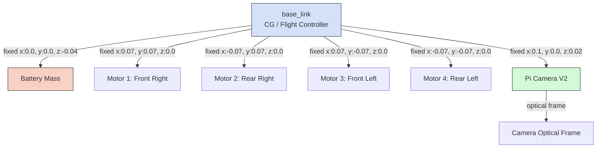

# Package: `uav_description`
**Status:** Digital Twin Mathematical Model Finalized  
**Purpose:** Defines the kinematic, dynamic, and sensory properties of the 6-inch UAV for the Gazebo Harmonic physics engine.

## 1. Overview
To ensure that the object-tracking PID loops tuned in simulation directly transfer to the physical drone (closing the Sim-to-Real gap), the simulated model must accurately reflect the drone's mass distribution, motor thrust curves, and sensor placement. This package contains the Simulation Description Format (SDF) files that define the UAV.

## 2. Mass and Moment of Inertia (MoI) Modeling
The drone is modeled as a composite of primitive geometries to accurately calculate the inertia tensor. The physical drone has an estimated All-Up Weight (AUW) of 1.50 kg (equipped with a 4S2P Li-ion pack and Pi 4). 

### 2.1 Theoretical Calculations
Assuming the central avionics and battery form a dense cuboid of mass $m_c = 1.0 \text{ kg}$ with dimensions $x=0.15m, y=0.15m, z=0.08m$, and the four 2807 motors ($m_m = 0.05 \text{ kg}$ each) sit at a radius of $r = 0.1 \text{ m}$ from the center of gravity (CG):

*   **Central Cuboid Inertia:**
    $$I_{xx,c} = \frac{1}{12}m_c(y^2+z^2) = \frac{1}{12}(1.0)(0.15^2 + 0.08^2) \approx 0.0024 \text{ kg}\cdot\text{m}^2$$
*   **Motor Point-Mass Addition (Parallel Axis Theorem):**
    $$I_{xx,m} = 4 \times (m_m \cdot d^2) = 4 \times (0.05 \cdot 0.07^2) \approx 0.0010 \text{ kg}\cdot\text{m}^2$$
*   **Total Diagonal Inertia ($I_{xx}, I_{yy}$):** $\approx 0.0034 \text{ kg}\cdot\text{m}^2$

These exact tensor values are hardcoded into the `drone.sdf` file to ensure the Gazebo physics engine accurately mimics the rotational latency of the 6-inch airframe.

## 3. TF (Transform) Tree and Sensor Frame

The SDF model mounts a virtual RGB camera and an IMU precisely where they sit on the physical CAD model.

## 4. Gazebo Plugins
The `drone.sdf` utilizes the following Gazebo Harmonic plugins:
1. `gz::sim::systems::Sensors`: Generates the 30fps camera feed for the YOLO tracker.
2. `ArduPilotPlugin`: Bridges the joint states and virtual IMU directly to the ArduPilot SITL binary via UDP.