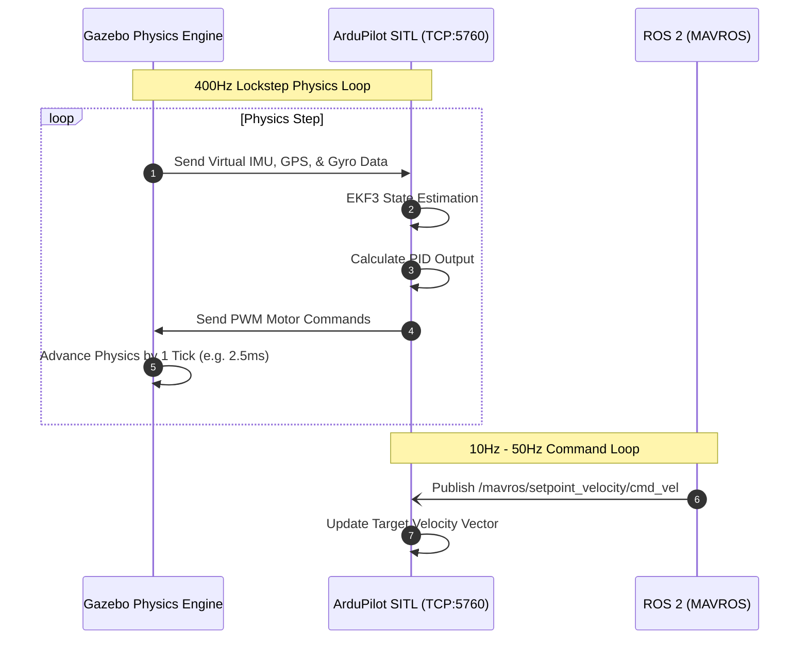

# Package: `uav_gazebo`
**Status:** SITL Architecture Scaffolding Complete  
**Purpose:** Handles the launch sequences, world environments, and the lockstep physics synchronization between Gazebo Harmonic and ArduPilot SITL.

## 1. Overview
Training an object-tracking drone requires an environment containing dynamic targets. This package contains the Gazebo `.sdf` world files and the ROS 2 launch files necessary to bootstrap the entire digital twin environment.

## 2. SITL Synchronization Architecture
Unlike standard ROS robots where Gazebo directly controls the joints, this architecture utilizes **ArduPilot SITL** as the middleman. ArduPilot expects to read sensor data, run its internal EKF3 state estimator, and output PWM signals just as it would on the physical SkyStars H7 board.

To achieve this, the `ardupilot_gazebo` plugin is used to achieve "Lockstep" simulation. The physics engine pauses until ArduPilot processes the virtual IMU data and replies with a motor PWM command, ensuring 100% deterministic flight behavior regardless of CPU load.

## 3. Launch File Hierarchy
The primary entry point is `sim_sitl.launch.py`, which executes the following dependency tree:

1. **Start Gazebo:** Launches `gz sim` with the custom `tracking_env.sdf` world.
2. **Spawn Model:** Injects the 6-inch drone SDF at coordinates `(0, 0, 0.5)`.
3. **Start ArduPilot:** Executes the native Linux `arducopter` binary configured for the Gazebo frame.
4. **Start ROS 2 Bridge:** Launches `ros_gz_bridge` to expose the virtual Pi Camera to the ROS 2 `sensor_msgs/Image` network.
5. **Start MAVROS:** Connects ROS 2 to the ArduPilot SITL instance via `udp://127.0.0.1:14550`.